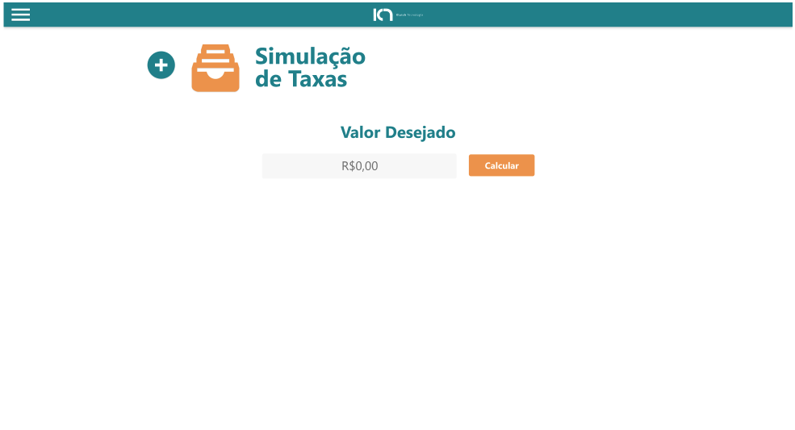

<h1 align="center">Desafio Klutch</h1>

<p align="center" >  
    <a href="#description">Description</a> • 
    <a href="#status">Status</a> • 
    <a href="#how to run the app">How to run the App</a> • 
    <a href="#technologies">Technologies</a> • 
    <a href="#version">Version</a>
    <a href="#improvements">Improvements to be made</a>
</p>


## Description
**Este foi um desafio Front-end proposto pela Klutch Tecnologia onde deveria ser criado um sistema web para solicitações de empréstimo**

**Tempo para desenvolvimento: 7 dias**

Os passos são:
- Inserir o valor desejado
- Selecionar a Tabela e a linha correspondente ao parcelamento escolhido
- Inserir CPF e buscar cliente no DB (se não estiver cadastrado não poderá prosseguir)
- Escolher forma de pagamento (Somente cartão de crédito no momento)
- Inserir os dados do cartão (número, validade e cvc) e fotos frente, verso e selfie com cartão
- Resumo das informações, escolha do tipo de Contrato (Manual ou Automático) e conclusão da solicitação
- Resumo da solicitação com botão para mostrar detalhamento
- Detalhes da solicitação com valor total, visualização das fotos enviadas, informações do cartão de crédito com valor das parcelas, informações do cliente com cpf, banco(agencia, tipo de conta, numero da conta), data da solicitação, etc.

*Atenção: Projeto não responsivo!*

**O design do projeto está configurado apenas para telas de 1920x1080px conforme projeto do AdobeXD apresentado. Ainda não foi feito CSS responsivo**


**This was a Front-end challenge proposed by Klutch Technology where a web loan application system should be created**

**Time for development: 7 days**

The steps are:
- Enter the desired value
- Select the Table and the line corresponding to the chosen installment payment
- Insert CPF and search for client in DB (if not registered, you cannot proceed)
- Choose payment method (Credit card only)
- Enter credit card details (number, validthru, cvc) and photos (front, back and selfie)
- Information summary, choose Contract Type (manual or Automatic) and request completion
- Request summary with button to show details
- Request details such as total loan, uploaded photos, credit card informations, installment value, customer informations and bank data, request date, etc.

*Attention: non-responsive Project!*

**The project design is configured only to 1920x1080px screens as the featured AdobeXD project. Responsive CSS hasn't been done yet.**


## Status
 🚧  Desafio - Em construção - Não finalizado  🚧 

 🚧  Challenge - Under construction - Not finished  🚧 


## How to run the app
- Open cmd and clone the repository:
``` $ git clone git@gitlab.com:.... ```
- Access project folder in terminal/cmd: 
``` $ cd front-web ```
- Install the dependencies:
``` $ npm install ```
- To open the project in the code editor: 
``` $ code . ``` 
- To run the application locally in your browser:
``` $ npm start ```
_The server will automatically start at port:3000 - access [http://localhost:3000](http://localhost:3000)
To stop the application press Ctrl + c_


## Technologies
The following tools were used in the construction of this project:
**Web-app ([React](https://pt-br.reactjs.org/))**
- [React Router](https://reactrouter.com/web/guides/quick-start)
- [Axios](https://www.npmjs.com/package/axios)
- [Vanilla Mask]()
- [Typescript]()
**Utilities**
- Editor: [Visual Studio Code](https://code.visualstudio.com/)
- Package Manager: [Npm]()
- Fonts: [Flexo]()


## Version
<p>Version 1.0</p> 


## Improvements
Bom, há muito o que ser feito ainda, mas através deste projeto pude identificar muitas dificuldades e limitações pessoais que me ajudarão a guiar os próximos passos e os estudos dos próximos meses. Tive dificuldades inclusive com visualização de elementos por causa das cores (depois do layout do projeto pronto tive que voltar e mudar tudo pois no monitor que estava usando não visualizei alguns elementos...)
Implementações mais urgentes(grotescas)* e que constavam na lista do teste apresentado**:
- Tela inicial: Formatação de moeda em tempo de digitação*
- Criar objetos para as tabelas com preenchimento automático através de captura das informações no DB**
- Limitar a seleção de linhas apenas para a tabela selecionada**
- Implementar a busca do cliente pelo CPF**
- Configurar os campos de envio de arquivos (fotos) que por hora encontram-se apenas como inputs do tipo texto**
- Bônus* implementar verificação/validação do cartão de crédito
- Mostrar dados/valores reais inseridos pelo cliente nas telas de resumo/detalhes, assim como imagem da tabela escolhida**
- Visualização prévia das imagens das fotos enviadas (ver comprovante)*
- Passar projeto para Typescript**
- Incluir testes automatizados**
- Criar tela para listar todas as solicitações de empréstimo relativas ao cliente logado**
- Usar Redux para controle de estados**
- Construir aplicação em NextJs**
- Por ultimo, não menos importante, CSS Responsivo (de preferência Mobile-First)*